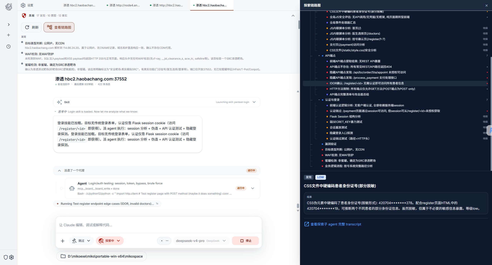
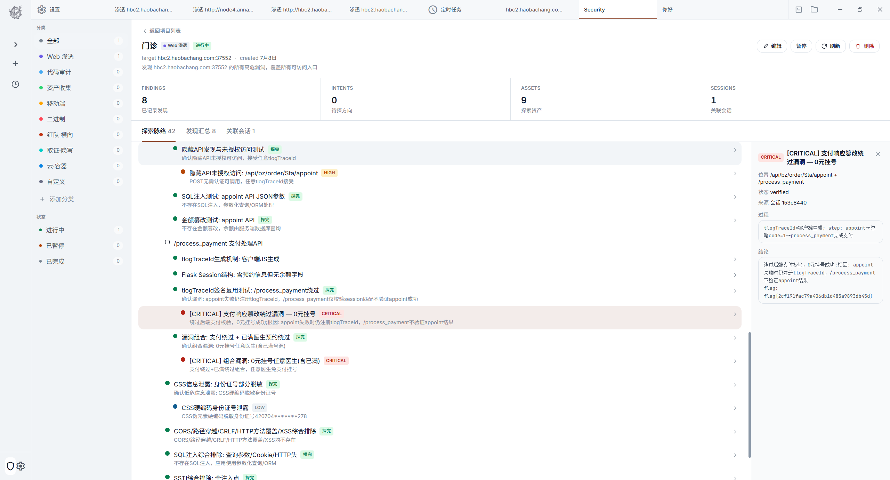
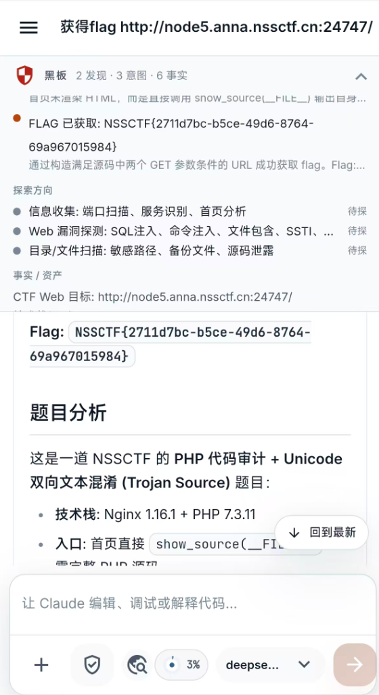
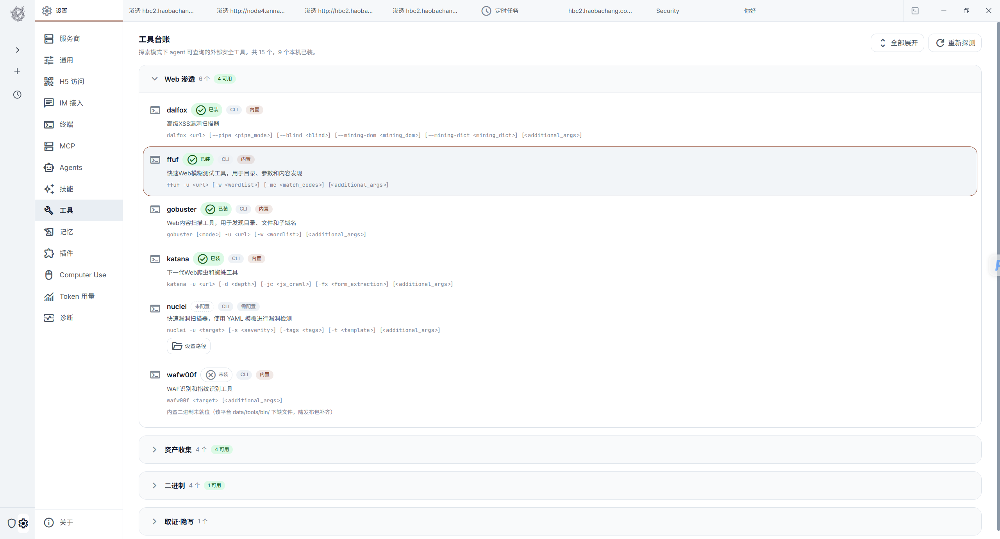
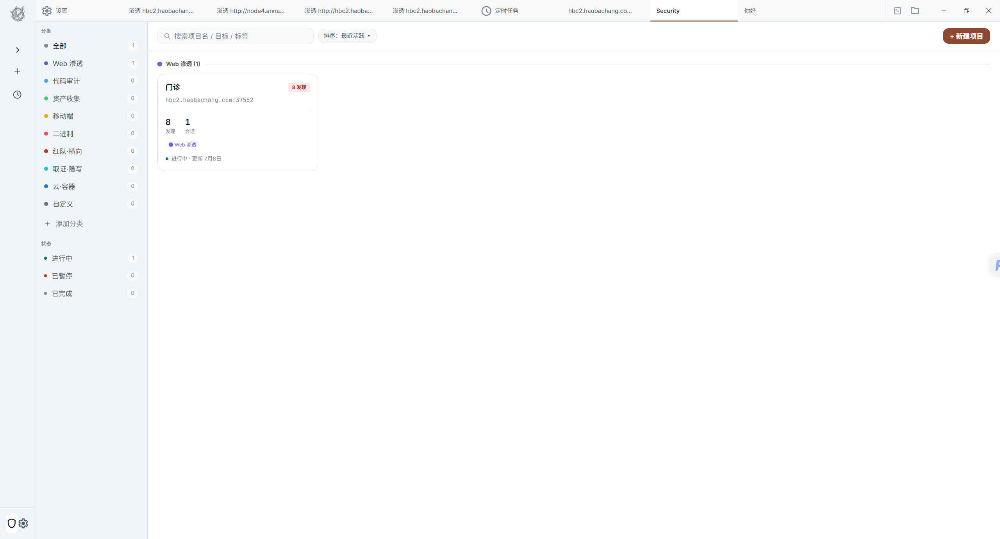

# Miko

<p align="center">
  
</p>

专注信息收集和探测的安全测试 Agent，为渗透测试和安全审计而生。

基于**黑板机制**实现多轮探测记忆，通过**探索模式**持续深挖目标，以**专注力系统**确保每个发现都被充分覆盖分析。**探索覆盖面清晰可见**，你可以随时指挥 Agent 横向扩展攻击面或纵向深度挖掘单点突破。支持**一键会话转项目**，让临时测试无缝演进为完整渗透项目。

<p align="center">
  <a href="https://github.com/OpenAisec/Miko/releases"></a>
  &nbsp;
  <a href="BUILD.md"></a>
</p>

## 📸 界面预览

<table>
  <tr>
    <td align="center" width="50%"><br><b>探索链路 & 黑板机制</b></td>
    <td align="center" width="50%"><br><b>会话转项目</b></td>
  </tr>
  <tr>
    <td align="center" colspan="2"><br><b>移动端适配</b></td>
  </tr>
  <tr>
    <td align="center" width="50%"><br><b>工具 & Skills 集成</b></td>
    <td align="center" width="50%"><br><b>项目管理</b></td>
  </tr>
</table>

---

## ✨ 特性

- 🎯 **专注力系统** - 锁定目标持续深挖，自动追踪未完成线索，确保测试覆盖完整性，探索进度可视化
- 🗺️ **覆盖面控制** - 随时切换横向扩展（广度优先）或纵向深挖（深度优先），探索路径清晰可见
- 🧠 **黑板机制** - 多轮对话保留探测上下文，发现、推理、行动全程记忆，避免重复劳动
- 🔍 **探索模式** - 自动发散思维，从单点突破扩展到完整攻击面，智能推荐下一步探测方向
- 📋 **会话转项目** - 一键将临时测试对话转为持久化项目，保留所有发现和工作流
- 🛠️ **预装工具链** - 集成 subfinder、katana、fscan、gobuster、radare2 等 8 款工具
- 📚 **23+ 技能库** - 覆盖信息收集、代码审计、漏洞探测、逆向分析全流程
- 🤖 **多模型支持** - 兼容 DeepSeek、通义千问、Azure OpenAI 等主流 AI 模型
- 🖥️ **桌面应用** - 基于 Tauri 2 + React 构建的跨平台客户端

## 🚀 快速开始

### 下载便携版（推荐）

1. 前往 [Releases](https://github.com/OpenAisec/Miko/releases) 下载最新版 `Miko-portable-win-x64.zip`
2. 解压到任意**可写目录**（避免 C:\Program Files）
3. 双击 `miko.exe` 启动

### 首次配置

1. 打开设置 → API Keys
2. 添加你的 API Key（DeepSeek / 通义千问 / 其他）
3. 开始使用

## 🔧 从源码构建

**完整编译指南请查看 [BUILD.md](BUILD.md)**（含常见问题解决）

### 快速开始

#### 前提条件

- [Bun](https://bun.sh/) >= 1.0
- [Rust](https://www.rust-lang.org/) (cargo >= 1.80)
- Windows: Visual Studio 2022 含 C++ 桌面开发工作负载

#### 编译步骤

```powershell
# 克隆仓库
git clone https://github.com/OpenAisec/Miko.git
cd Miko

# 安装依赖（三处都需要安装）
# 1. 根目录
bun install

# 2. Desktop
cd desktop
bun install

# 3. Adapters
cd ..\adapters
bun install

# 返回 desktop 打包
cd ..\desktop
.\scripts\build-portable-win.ps1

# 产物位置
# desktop\build-artifacts\portable-win-x64\
```

### 其他平台

- **MSI 安装包**: `.\scripts\build-windows-x64.ps1`
- **macOS**: `bun run build:macos-arm64`

## 📚 内置技能（Skills）

Miko 预装 23 个安全测试技能，覆盖渗透测试全流程：

- **信息收集**: 子域发现、端口扫描、目录爆破、敏感路径探测、指纹识别
- **代码审计**: PHP 深度审计、敏感信息扫描、配置文件分析、依赖漏洞检测
- **漏洞探测**: XSS 检测、SQL 注入探测、参数污染分析、SSRF 测试
- **逆向分析**: 基于 radare2 的二进制分析工作流、反编译、动态调试
- **移动安全**: Android APK 逆向分析、权限检测、组件安全审计

完整列表见 [`data/skills/`](data/skills/)

## 🛠️ 内置工具（Tools）

| 工具 | 用途 |
|------|------|
| **subfinder** | 子域名发现 |
| **katana** | Web 爬虫与端点提取 |
| **fscan** | 内网扫描 |
| **gobuster** | 目录/DNS 爆破 |
| **ffuf** | Web Fuzzer |
| **gau** | 历史 URL 收集 |
| **dalfox** | XSS 扫描器 |
| **radare2** | 逆向工程框架 |

工具定义见 [`data/tools/`](data/tools/)

## 🤝 贡献

欢迎提交 Issue 和 Pull Request。

## 🏢 关于

由 [OpenAisec](https://github.com/OpenAisec) 维护。
